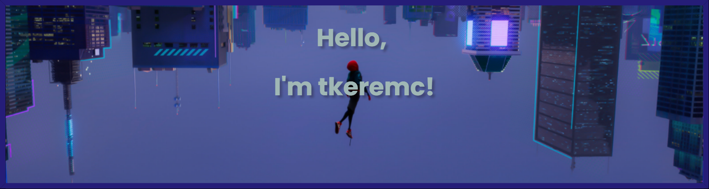

  <h1>Hello!  I'm Tarık</h1>
  
A software developer with a passion for learning new technologies and creating exciting projects. 
  Currently focused on .NET 8 and expanding my skills with innovative tools and technologies. 💻

  
More about me

- 🔭 **Currently Working On:** [GangChat](https://github.com/tkeremc/gangchat) - A project to build a real-time communication platform.  
- 🌱 **Currently Learning:** .NET 8 and diving deeper into backend development.  
- 💼 **Experience:** Python, JavaScript, Unity, C, C++, HTML, CSS.  
- 🎮 **Hobbies:** Game development and exploring innovations in the tech world.  
- 📫 **Contact Me:** [LinkedIn](https://www.linkedin.com/in/tar%C4%B1k-kerem-%C3%A7ifciba%C5%9F%C4%B1-86398030b/) | [Email](mailto:tkeremc@outlook.com)

---

## 🛠️ Skills

### **Programming Languages**
- 🐍 Python, C
- 🌐 JavaScript, HTML, CSS
- 🎮 Unity (C#)

### **Frameworks and Tools**
- .NET 8 (currently learning)    
- Unity Engine  

### **Database Technologies**
- MySQL, MongoDB

  

---

## 📊 My Stats
<!--

-->

